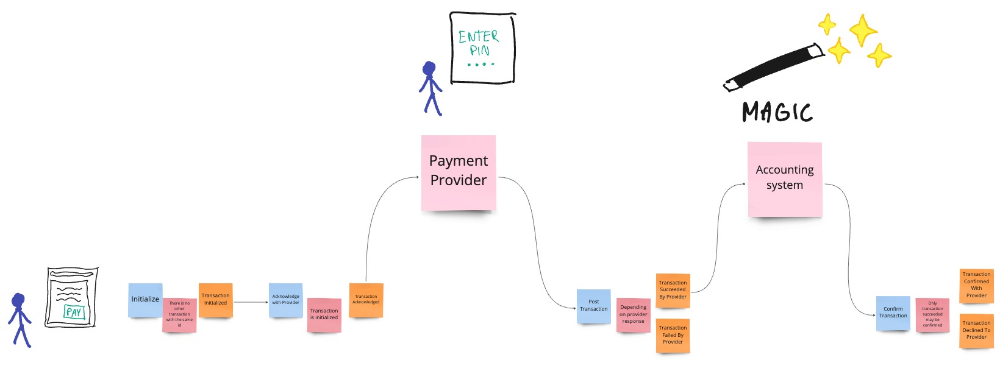

# Payment system made functional

## Introduction

The project has been inspired by the book "Domain Modeling Made Functional: Tackle Software Complexity with Domain-Driven Design and F#" by  Scott Wlaschin.
The main idea was to get familiar with F# language and the functional programming paradigm.

The system implements a sample payment integration with 3rd party.

The project isn't idea and it does't have to be. 

## Payment flow

The payment flow looks like this:

